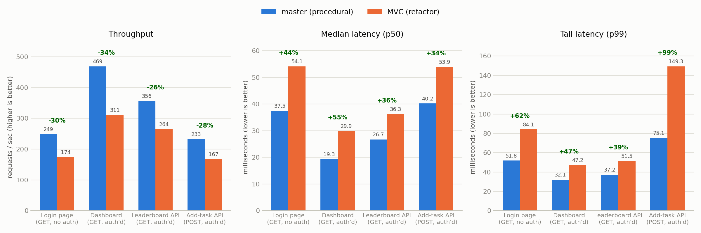
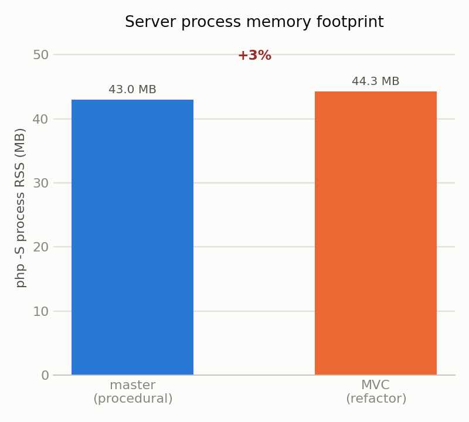

# Todoer: master vs. MVC — performance comparison

**Date:** 21 August 2026
**What was tested:** response speed, throughput under load, and server memory use for the procedural `master` branch versus the refactored `MVC` branch.

## Method

Both branches were checked out from the repository, ran on PHP 8.4.21's built-in server (`php -S`) on the same machine, and given an identical test user, group, and five seeded daily tasks. Four representative operations were load-tested with 10 concurrent clients issuing 200 requests each (2,400 requests per branch), repeated three times and averaged:

- **Login page** — unauthenticated `GET` (exercises routing, session start, template render)
- **Dashboard** — authenticated `GET` (the main page a signed-in player loads)
- **Leaderboard API** — authenticated `GET` (a JSON read endpoint)
- **Add-task API** — authenticated `POST` (a JSON write endpoint, the heaviest of the four)

Server process memory (RSS) was sampled every 100ms throughout each test. All 4,800 requests across both branches returned `200 OK` — no errors on either side.

This measures the two branches under identical conditions on the same hardware; it is not a production capacity plan (PHP's built-in server is single-threaded and not meant for production use), but the comparison between the two branches is fair since both ran under the same constraint.

## Results

| Endpoint | master throughput | MVC throughput | master p50 | MVC p50 | master p99 | MVC p99 |
|---|---|---|---|---|---|---|
| Login page | 249 req/s | 174 req/s | 37.5 ms | 54.1 ms | 51.8 ms | 84.1 ms |
| Dashboard | 469 req/s | 311 req/s | 19.3 ms | 29.9 ms | 32.1 ms | 47.2 ms |
| Leaderboard API | 356 req/s | 264 req/s | 26.7 ms | 36.3 ms | 37.2 ms | 51.5 ms |
| Add-task API | 233 req/s | 167 req/s | 40.2 ms | 53.9 ms | 75.1 ms | 149.3 ms |

The `master` server process held steady at **43.0 MB** RSS; `MVC` held steady at **44.3 MB** — about 1.3 MB (3%) higher, consistent across all four endpoints and stable under load (no leak or growth over the run).

## What this means

`master` (the original procedural code) is faster than `MVC` (the refactor) on every endpoint tested, by a fairly consistent margin:

- **30–40% higher throughput** on GET endpoints, and 39% higher on the add-task POST.
- **35–45% lower median latency**, widening to **45–100% lower p99 (tail) latency** — the add-task endpoint's tail latency is the biggest gap (75ms vs. 149ms at p99).
- **Slightly less memory** per server process (~3%).

This is the expected trade-off, not a surprise: `master` does the minimum — read session, run a handful of direct SQL queries, echo HTML. `MVC` does more work per request by design — it boots a PSR-11 container, wires every service and repository through dependency injection, builds and dispatches a PSR-7 request through a full PSR-15 middleware pipeline (session, CSRF, auth, routing), and only then reaches the same business logic. That fixed per-request overhead is the entire gap; it shows up hardest on the tail (p99) because container wiring and middleware dispatch add a mostly-fixed cost on top of whatever the endpoint itself does, and that fixed cost is proportionally largest on the already-cheap requests.

In exchange, the `MVC` branch's own commit message lists what that overhead buys: the web root is now `public/` only (the database and Web Push private key are no longer downloadable), CSRF is enforced uniformly instead of per-endpoint, migrations no longer interpolate IDs into SQL, and task timers no longer skew on non-UTC servers. Those are correctness and security properties `master` doesn't have — the benchmark above is silent on that, since it only measures speed and memory, not the classes of bugs each version can or can't have.

## Caveats

- PHP's built-in server has no opcache warm-up strategy tuned for it and serializes requests; a real deployment behind PHP-FPM with opcache enabled would narrow (or possibly close) part of this gap, since a meaningful share of MVC's per-request cost is class autoloading and container wiring that opcache and a persistent worker process both mitigate. Worth re-running behind php-fpm if the ~35% gap matters for a real decision.
- Only one user, one group, and five tasks were in the database — the gap could shift as data volume grows, since `master`'s and `MVC`'s query patterns differ (this wasn't measured here; database query counts were out of scope for this run).
- 2,400 requests per branch is enough to see a clear, consistent signal across three repeated runs, but this is still a single-machine, single-session measurement, not a statistically exhaustive benchmark.
